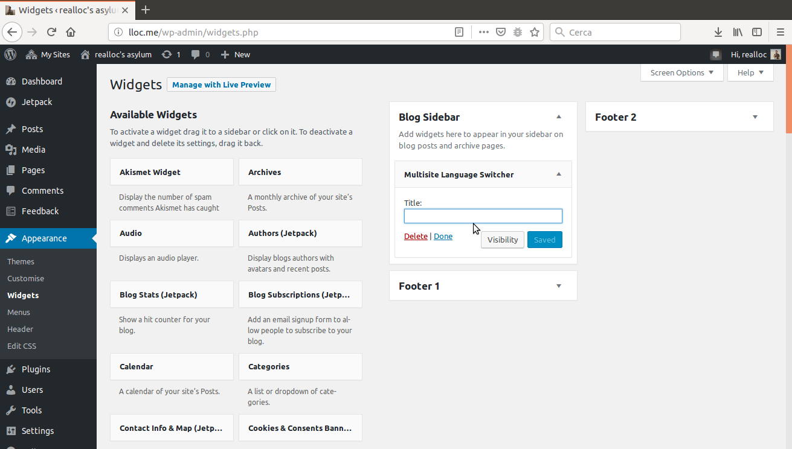

# Integration in your website

### Using the widget

As described in the section [Editing association of posts](https://realloc.gitbook.io/multisite-language-switcher/~/edit/drafts/-LThOwKzK8_JX9OhahE6/setup/editing-association-of-posts), besides indicating for each post or page the available translations, the widget can be integrated in a sidebar.



The output depends on your settings in the plugin configuration and on the CSS of your theme but here an example:


### Using the shortcode

The Multisite Language Switcher comes with the shortcode:

```text
[sc_msls]
```

You can insert it into your posts or pages when you want to show a link to the alternative translation of the current content.

### Using the MSLS API 

It is also possible to directly use the plugin features in your theme. In this blog for instance, I've used the following code in the _header.php_ file of my WordPress theme.

```text
<?php if ( function_exists( 'the_msls' ) ) the_msls(); ?>
```

