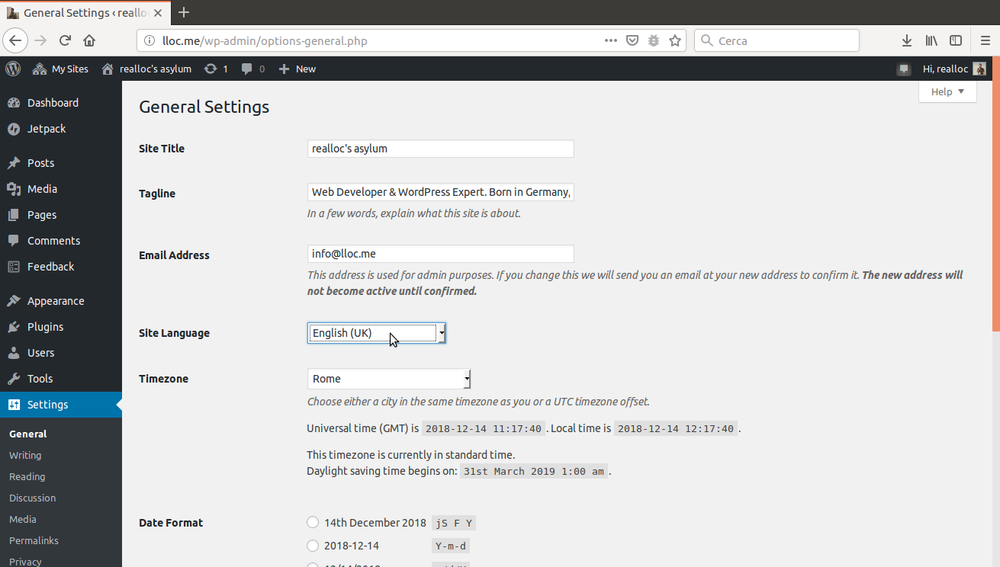

# Plugin configuration

### Choose the blog language 

In order to choose the blog language, go to the administration menu, to Settings/General and choose the language at the bottom of that page.

> The default downloaded version of WordPress includes only one language. Make sure that you already have the WordPress files related to the languages that you want to use on the other blogs! For this to work, you have to install less .mo files concerning the languages that you want: See the following articles.

> * [Installing WordPress in Your Language](http://codex.wordpress.org/Installing_WordPress_in_Your_Language)
> * and [WordPress in your language](http://codex.wordpress.org/WordPress_in_Your_Language)

### Activate the plugin 

After you [downloaded the Multisite Language Switcher plugin](https://wordpress.org/plugins/multisite-language-switcher/) and extracted the .zip file, copy the entire folder onto the following sub-folder of your WordPress installation:

`wp-content/plugins/`

So far the plugin installation follows the usual procedure. In a practical way, the plugin activation can then be made

* either by the **network administrator** on all the blogs,
* or by the **root blog administrator** for each particular blog.

### Settings in the administration menu 

The plugin settings are rather simple \(in the **Administration Menu -&gt; Settings -&gt; Multisite Language Switcher**\). You need to activate the plugin once in each blog : click « Save » at the bottom of the settings even if you haven’t changed anything yet. It’s the only way for the plugin to offer the necessary flexibility, regarding each language for example.

### Choose the display settings 

You can choose 4 kinds of displaying:

* flag and description
* flag only
* description only
* description and flag

With the next 4 fields, it is possible to add some text or code HTML in order to personalise the HTML list to appear on the front end when your use the plugin.

### Indicate to the visitor the available languages available to read the post 

With the last two features, you decide if you wish to let the visitor know \(and for the system under which priority\) the various translations are offered.

